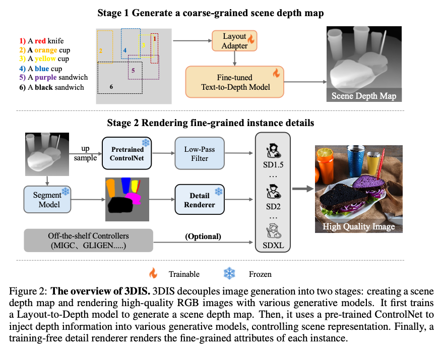

# 3DIS: DEPTH-DRIVEN DECOUPLED INSTANCE SYN- THESIS FOR TEXT-TO-IMAGE GENERATION
**3DIS: DEPTH-DRIVEN DECOUPLED INSTANCE SYN- THESIS FOR TEXT-TO-IMAGE GENERATION**
 _Dewei Zhou, Ji Xie, Zongxin Yang, Yi Yang_ 

## To Do List
- [ ] Code
- [ ] pretrained weights
