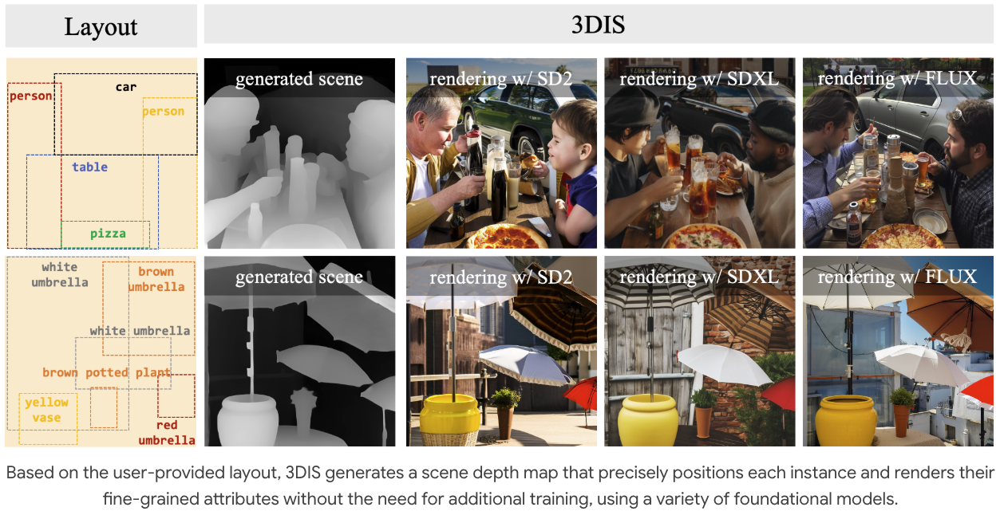
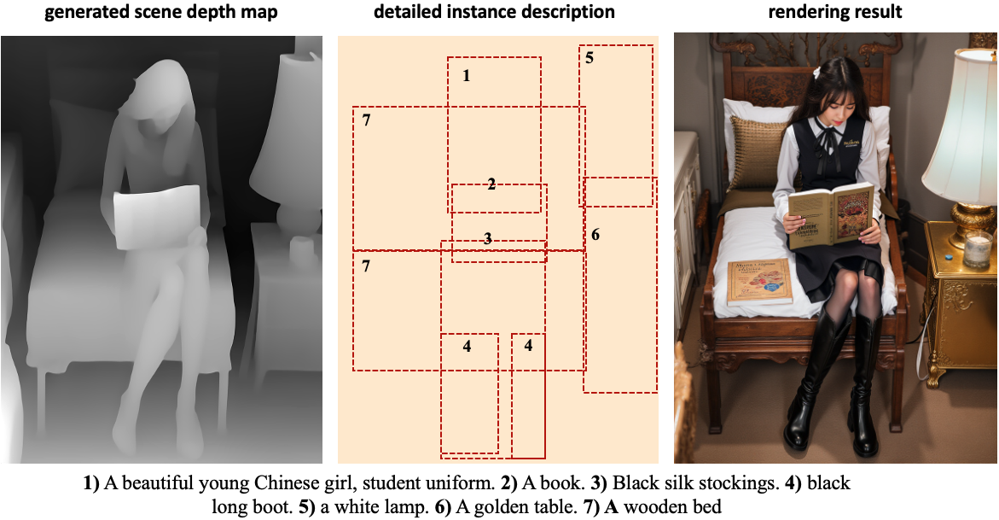
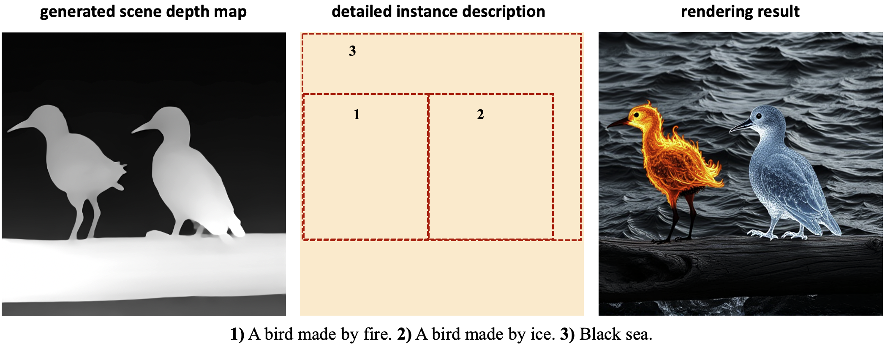
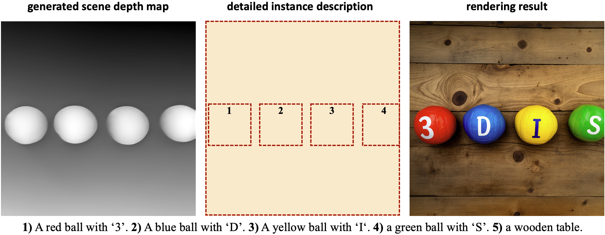
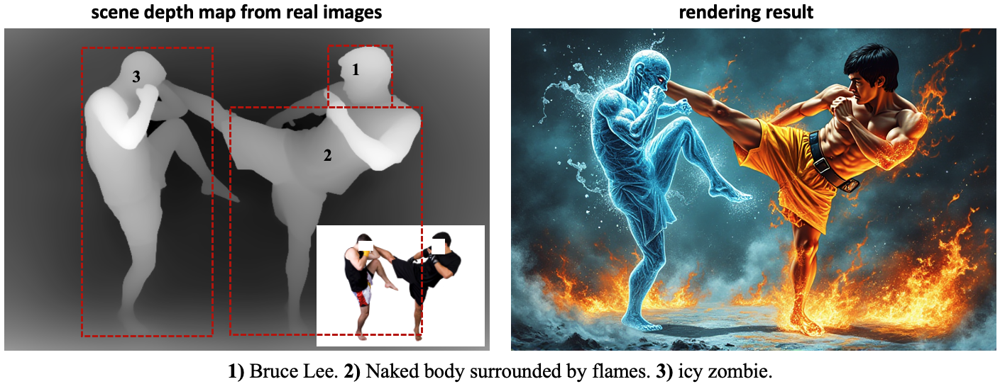
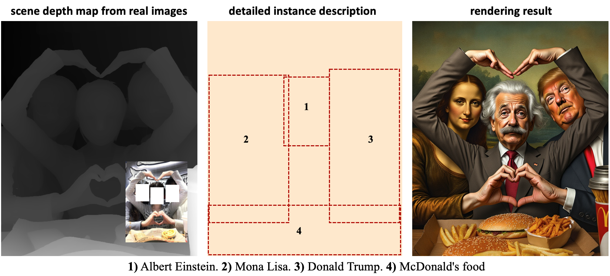
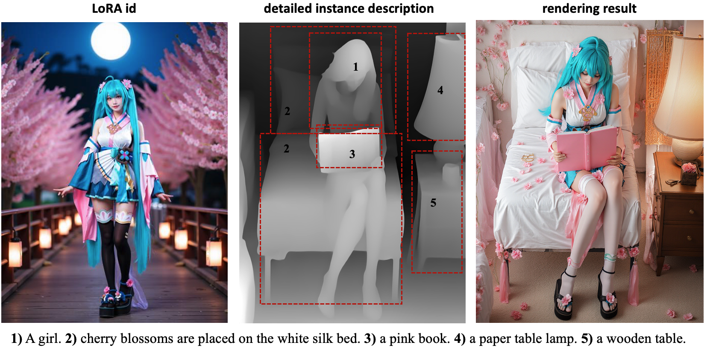

# 3DIS: DEPTH-DRIVEN DECOUPLED INSTANCE SYNTHESIS FOR TEXT-TO-IMAGE GENERATION


[[Project Page]](https://limuloo.github.io/3DIS/)  [[3DIS Paper]](https://arxiv.org/pdf/2410.12669) [[3DIS-FLUX Paper]](https://arxiv.org/pdf/2501.05131) [[Huggingface Page]](https://huggingface.co/sanaka87/3DIS)



## To Do List
- [x] Code
- [x] pretrained weights
- [x] 3DIS GUI
- [ ] More Demos

<a id="Installation"></a>
## Installation

### Conda environment setup
```
conda create -n 3DIS python=3.10 -y
conda activate 3DIS
pip install -r requirement.txt
pip install -e .
cd segment-anything-2
pip install -e . --no-deps
cd ..
```

### Checkpoints 🚀

**Step1** Download the checkpoint of the fine-tuned Text-to-Depth model, [unet_0901.ckpt](https://drive.google.com/file/d/1JJt5HPtVravufxSz46x__0ASt7b6fYel/view?usp=sharing).

**Step2** Download the checkpoint of the trained Layout-to-Depth Adapter, [layout_adapter.ckpt](https://drive.google.com/file/d/19rHJYrafOCQQk-zFj692vCYVNcLm1b9g/view?usp=sharing).

> You can also get our **pretrained weights** from **[Huggingface🤗](https://huggingface.co/sanaka87/3DIS)**.

**Step3** Download the checkpoint of the SAM2, [sam2_hiera_large.pt](https://drive.google.com/file/d/1QjdY64w7pKm8smh0bV7K9-joeZiow8e0/view?usp=sharing).

**Step4** put them under the 'pretrained_weights' folder.
```
├── pretrained_weights
│   ├── unet_0901.ckpt
│   ├── layout_adapter.ckpt
│   ├── sam2_hiera_large.pt
├── threeDIS
│   ├── ...
├── scripts
│   ├── ...
```

## Layout-to-Depth Generation 🎨
### Single Image Example
You can quickly run inference for layout-to-depth generation using the following command:
```
python scripts/inference_layout2depth_demo0.py
```
<p align="center">
  
</p>

## Rendering Generated Scene with Various Models 🌈
### Rendering with FLUX
You can quickly run inference for FLUX rendering using the following command:
```
python scripts/inference_flux_rendering_sam_demo0.py  --width=768 --height=1024 --i2i=4 --use_sam_enhance
```
<p align="center">
  
</p>

```
python scripts/inference_flux_rendering_sam_demo1.py  --use_sam_enhance --res=512 --i2i=4
```
<p align="center">
  
</p>

```
python scripts/inference_flux_rendering_sam_demo2.py  --use_sam_enhance --res=768 --i2i=3
```
<p align="center">
  
</p>

**More interesting demos will be coming soon!!!**


## End-to-end Layout-to-Image Generation 📐
You can quickly run inference for end-to-end layout-to-image generation using the following command:

```
python scripts/inference_layout2image_demo0.py --use_sam_enhance
```
<p align="center">
  
</p>


## Rendering Real Scene Depth Maps 📚
You can also apply our method to render the scene depth map extracted from a real-world image:

```
python scripts/inference_flux_rendering_sam_demo3.py  --height=512 --width=768 --i2i=4 --use_sam_enhance
```
<p align="center">
  
</p>


```
python scripts/inference_flux_rendering_sam_demo5.py  --height=768 --width=640 --i2i=2
```
<p align="center">
  
</p>

## Rendering with LoRA📚
Rendering with the [Miku LoRA](https://civitai.com/models/847629?modelVersionId=1254749):

```
python scripts/inference_flux_rendering_sam_demo4.py  --height=1024 --width=768 --i2i=2
```
<p align="center">
  
</p>


## Create with 3DIS GUI ⭐️
Use the following command to create a scene depth map with 3DIS GUI:
```
cd 3dis_gui
python layout2depth_app.py --port=3421
```


Use the following command to render the scene depth map with 3DIS GUI using FLUX:
```
cd 3dis_gui
python flux_rendering_app.py --port=3477
```


## Citation
If you find this repository useful, please use the following BibTeX entry for citation.
```
@article{zhou20243dis,
  title={3dis: Depth-driven decoupled instance synthesis for text-to-image generation},
  author={Zhou, Dewei and Xie, Ji and Yang, Zongxin and Yang, Yi},
  journal={arXiv preprint arXiv:2410.12669},
  year={2024}
}

@article{zhou20253disflux,
  title={3DIS-FLUX: simple and efficient multi-instance generation with DiT rendering},
  author={Zhou, Dewei and Xie, Ji and Yang, Zongxin and Yang, Yi},
  journal={arXiv preprint arXiv:2501.05131},
  year={2025}
}
```